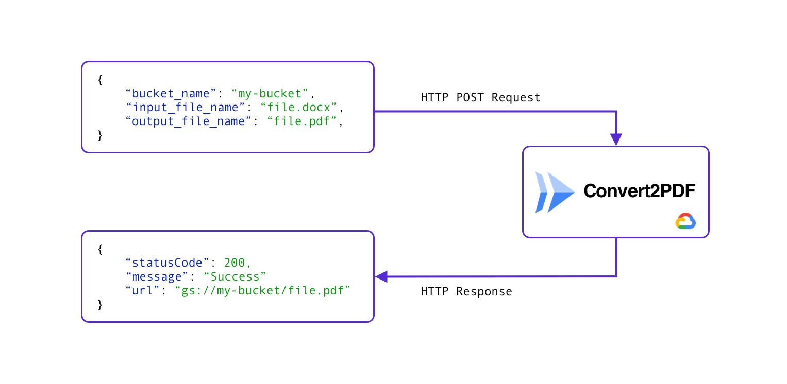

# Convert2PDF

This repository contains the implementation of an API to convert [MS Office Suite](https://apps.microsoft.com/detail/9mwk7rn11c5z?cid=majornelson) files to PDF. The followin image describes the Request and Response accepted and returned respectively from the API:



In addition, this repository contains the implementation of a service to summarize documents using GenAI, where a showcase is made on the call to the Convert2PDF API when the file is from the [MS Office Suite](https://apps.microsoft.com/detail/9mwk7rn11c5z?cid=majornelson).


# 1. How to deploy the API in Google Cloud
This section explains the requirements and implementations necessary to host and deploy the containerized API localized in `app/`.

### 1. Authenticate

The first step is to authenticate via `gcloud` as shown below:

```bash
$ gcloud init
$ gcloud auth application-default login
```

When entering the above commands, the respective credentials will be required for authentication.

### 2. Initialize global variables

Next, we will need to export environment variables which refer to the `PROJECT_ID` and `REGION` of the project:

```bash
$ export PROJECT_ID="project-id" 
$ export REGION="us-central1" 
```

### 3. Create Artifact Registry to store Docker images

Next, we will create a repository for Docker images in [Artifact Registry](https://cloud.google.com/artifact-registry):

```bash
$ gcloud artifacts repositories create cloudrun-images \
--repository-format=docker \
--location=$REGION \
--description="images for cloud run deploy" \
--immutable-tags \
--async
```

### 4. Configure local permissions

In order to connect from our premises to Artifact Registry, we need to assign the respective permissions:

```bash
$ gcloud auth configure-docker $REGION-docker.pkg.dev
```

This will allow us to push docker images from our local machine.

### 5. Build the Docker image using Cloud Build

To build the image from the Dockerfile, we will use Cloud Build as shown below:

```bash
$ gcloud builds submit --tag $REGION- docker.pkg.dev/$PROJECT_ID/cloudrun-images/convert2pdf:latest
```

### 6. Deploy Cloud Run API

Once the image is built, we will deploy it to Cloud Run with the following command:

```bash
$ gcloud run deploy convert2pdf \
--image $REGION-docker.pkg.dev/$PROJECT_ID/cloudrun-images/convert2pdf \
--platform managed \
--region $REGION \
--allow-unauthenticated 
```

### 7. Test API

```bash
curl -X POST \
-H "Content-Type: application/json" \
-d '{
    "bucket": "my-bucket",
    "input_file_name": "file.docx",
    "output_file_name": "file.pdf" 
}'  \
https://convert2pdf-hl3pwu44oa-uc.a.run.app/convert2pdf
```


# 2. Application for Summarization
In this section we will see how to deploy the file summarization service in a Cloud Function.

*IN PROGRESS*

**This section has to be reviewed**

1. create bucket for storing 
   
2. Create Pub Sub topic
   ```bash
    TOPIC_NAME="documents" 
    gcloud pubsub topics create $TOPIC_NAME    
   ```
3. Add notifications to the bucket created in step 2.
   ```bash
    BUCKET_NAME="bucket-flutter-app"

    gcloud storage buckets notifications create gs://$BUCKET_NAME --topic=$TOPIC_NAME    
   ```
4. Create Cloud function with 

    ```bash
    gcloud functions deploy fill_word_template \
    --project=$PROJECT_ID \
    --region=$REGION \
    --runtime python39 \
    --trigger-http \
    --source . \
    --entry-point fill_word_2_pdf \
    --set-env-vars "TEMPLATE_BUCKET_NAME=doc-ai-extractor-temp,TEMPLATE_FILE_NAME=convenio_confidencialidad.docx,OUTPUT_BUCKET_NAME=doc-ai-extractor-temp,PDF_CONVERTER_URL=https://convert2pdf-hl3pwu44oa-uc.a.run.app/convert2pdf" \
    --timeout 240s \
    --memory 512MB \
    --gen2
    ```


# References
- https://cloud.google.com/run/docs/building/containers
- https://cloud.google.com/artifact-registry/docs/docker/troubleshoot
- https://cloud.google.com/run/docs/deploying#gcloud
- https://github.com/sekR4/FastAPI-on-Google-Cloud-Run
- https://medium.com/@saverio3107/deploy-fastapi-with-docker-cloud-run-a-step-by-step-guide-a01c42df0fee